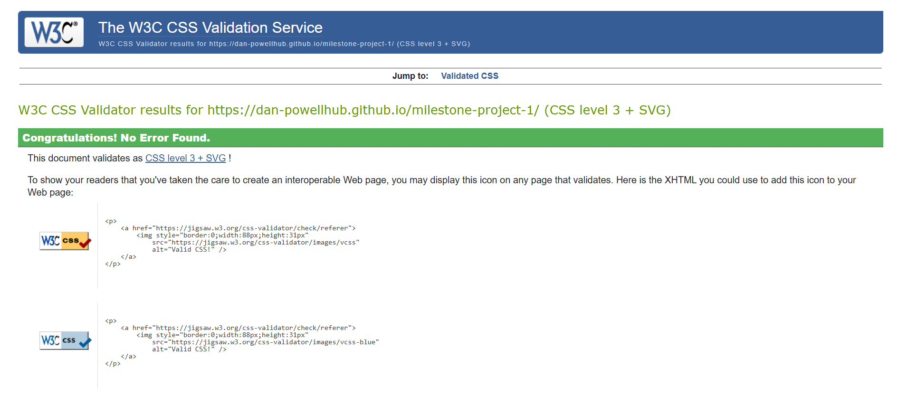
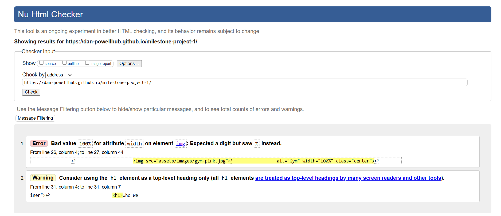

#Community Gym Website

##User stories
As a community member,
I want to view the gym’s class schedule on the website,
So that I can plan my visits and attend the classes that fit my routine.

As a first-time visitor,
I want to find the gym’s opening hours and location easily on the website,
So that I can visit at the right time and know how to get there.

**The contact page displays the gym’s regular opening hours.

The Contact page has the address**

As a potential member,
I want to understand the gym’s mission and community focus,
So that I can decide if the gym aligns with my values and goals.

**There’s a clearly written mission statement on the index page.

The mission reflects the gym’s commitment to health, inclusivity, and community engagement.**

Table of Contents

Project Overview

Pages & Features

Home Page (index.html)

Class Schedule Page (Schedule-page.html)

Contact Page (Contact-page.html)

Thank You Page (thankyou.html)

Technologies Used

Installation

Usage

Assets

Validation

Conclusion

##Project Overview

Welcome to the Community Gym website! 

This project features a simple HTML and CSS-based website designed for a local gym. It includes the homepage, class schedules, and a contact page, as well as a modern design using basic HTML5 and CSS3 techniques. The site is fully responsive and can be adapted for any gym or fitness community.

##Pages and Features

###Homepage: 
The homepage introduces what the Community Gym is and includes a brief description of the gym, its purpose, and its offerings (e.g., strength & cardio training, group classes, personal training, etc.).

###Class Schedule Page: The class schedule lists available fitness classes with descriptions and images (e.g., Pump, HIIT, Bootcamp).

###Contact Page: The contact page provides contact information, opening hours, and a contact form.

###Thankyou Page: The thank you page provides a message saying thank you for your message when somebody submits a form. 

###Technologies Used
Built using VS Code by Dan Powell

###License

###Installation
To run this website on your local machine, follow these steps:

Clone the repository:

bash
Copy
Edit
git clone https://github.com/username/community-gym-website.git
cd community-gym-website
Ensure you have all the assets:

The website relies on images stored in assets/images/ for the gym photos and class images. Make sure all images are correctly placed in the assets/images/ directory.

Open the project in a browser:

Open the Home-page.html file in your preferred browser to view the homepage.

###Usage
To use the site, simply navigate through the various pages:

**Index:** View the introduction to Community Gym and its offerings.

**Class Schedule:** Browse the schedule for fitness classes and click on each to view more details about each class.

**Contact Page:** Use the contact form to send messages to the gym, and view operating hours and contact information.

###Assets
The project consists of the following files and directories:

index.html: The homepage that introduces the gym and its offerings.

Schedule-page.html: A page showing the available fitness classes and detailed descriptions.

Contact-page.html: The contact page where users can fill out a form or view the gym's contact information.

styles.css: The main stylesheet for the website, containing the layout and design styles.

assets/images/: A folder containing all the images used on the site.

###Validation

###Conclusion
The Community Gym website is a simple but functional project built with HTML and CSS. It showcases key features that a gym website should have, including class schedules, contact information, and an engaging homepage. It's a great starting point for building a gym's online presence and can be easily customised for different fitness centers.
